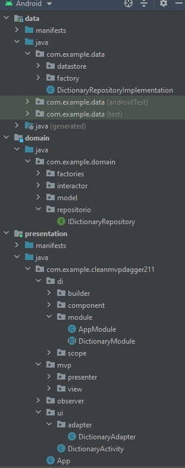

# CleanMVPDagger211

## Description
APP of Book: "Android from architecture design to professional deployment".

## Targets
* Learn a clean architecture.
* Learn to use Dagger2 for Dependencies Injection 

## Knowledge obtained
* Clean architecture with MVP.
* RxJava
* Know to use Dagger2
